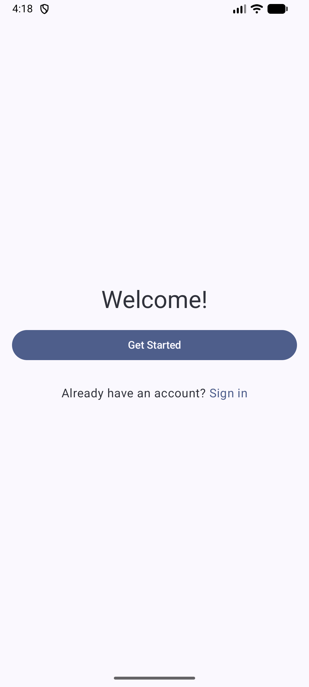
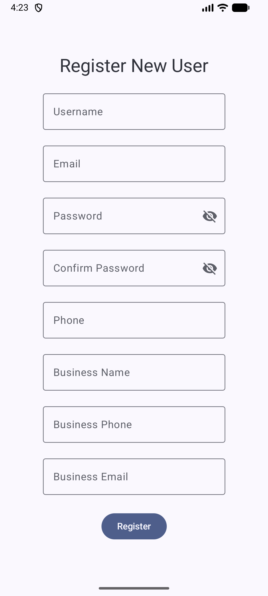
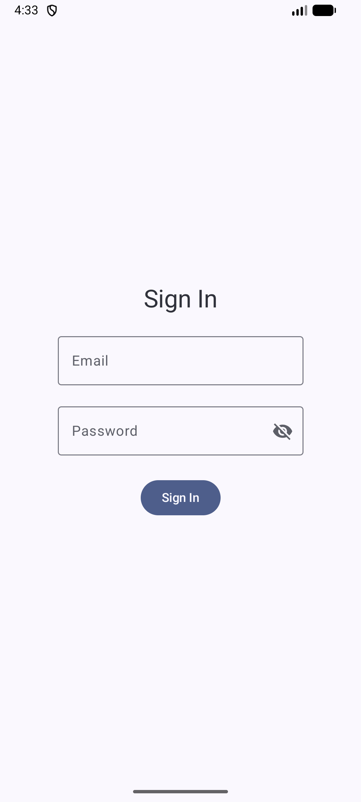
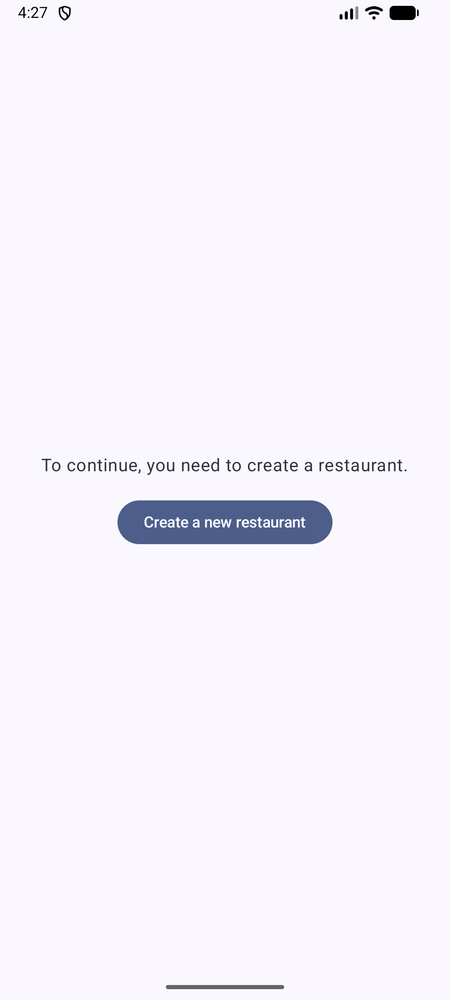
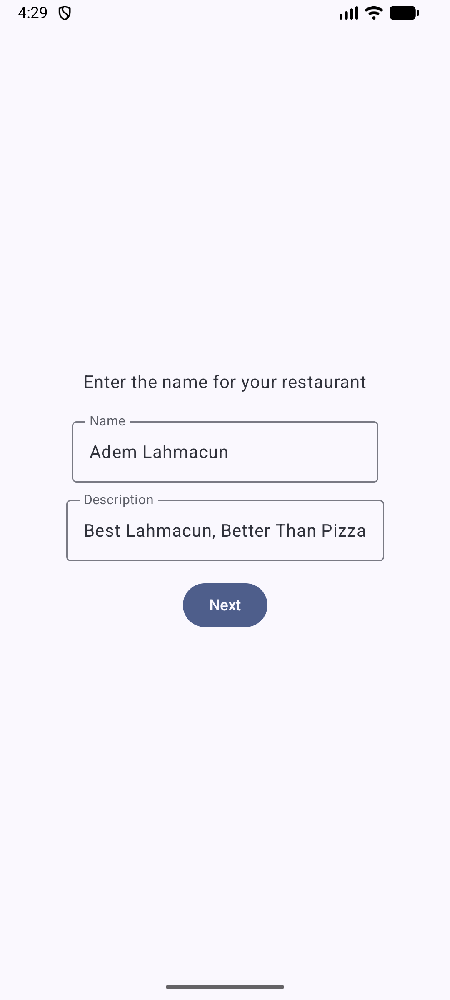
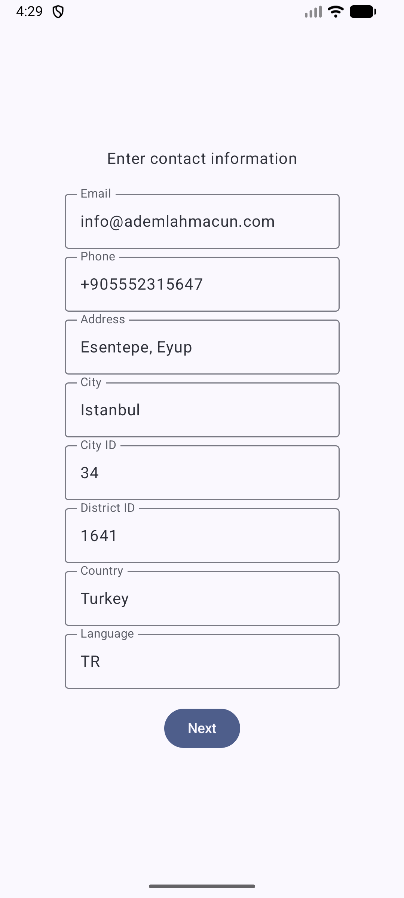
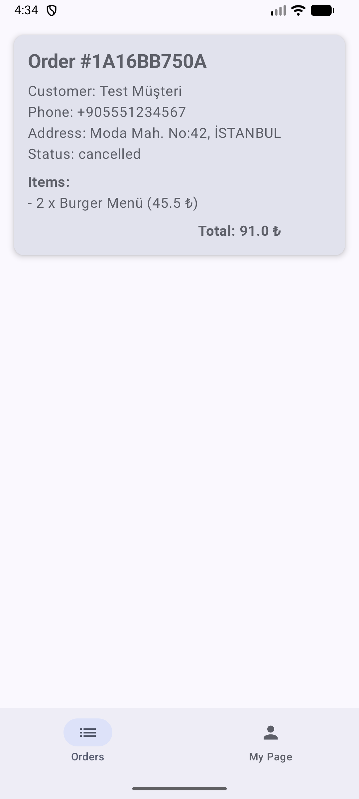
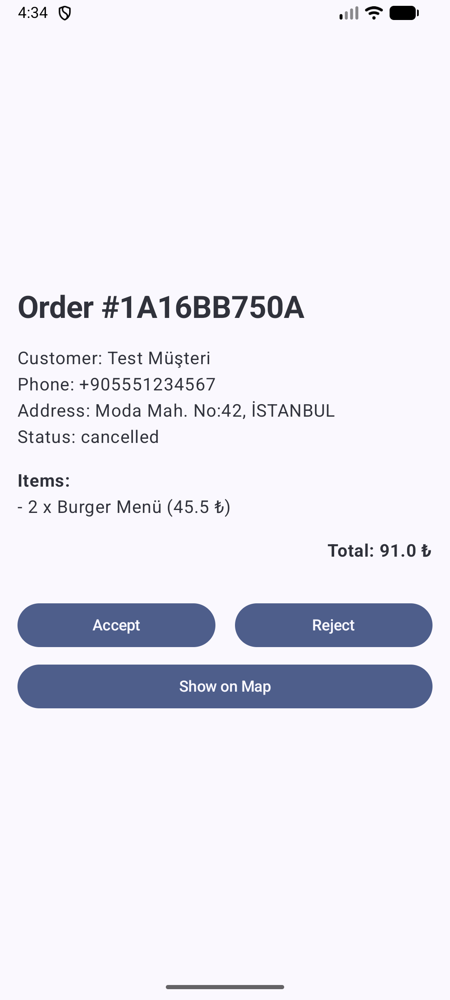
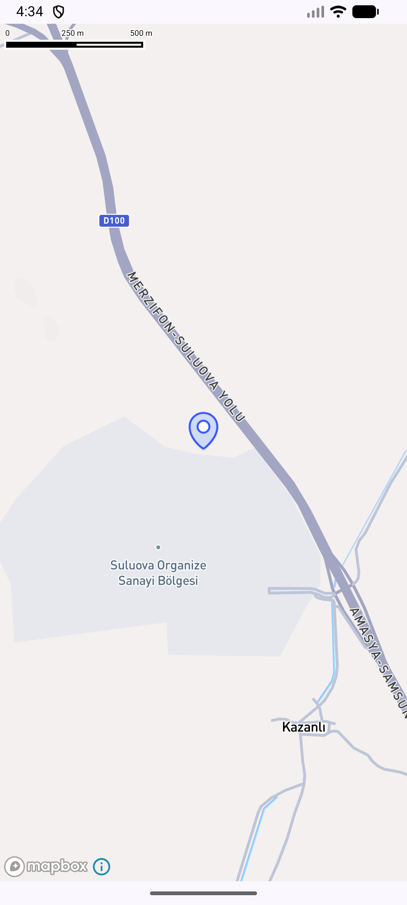
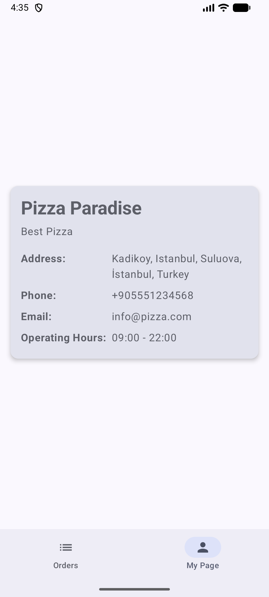

# Restaurant Order Tracker

Restaurant Order Tracker is a native Android application designed for restaurant owners to manage
incoming food orders in real-time. It provides a seamless interface for viewing order details,
managing restaurant information, and visualizing delivery locations on a map.

## Key Features

- **Real-time Order Updates**: Automatically receives new orders via WebSockets, ensuring no delays
  in order processing.
- **Pull-to-Refresh**: Manually refresh the order list with a simple pull gesture.
- **Smooth UI Animations**: Enjoy a fluid user experience with side-to-side sliding animations when
  switching between screens.
- **Restaurant Management**:
    - User registration and login.
    - Create and manage restaurant profiles, including contact information and business hours.
- **Order Details**: View comprehensive details for each order, including customer information,
  items ordered, and total amount.
- **Interactive Map**: Display the customer's delivery address on an interactive map for easy
  visualization.

## Technologies and Libraries Used

- **UI**:
    - **Jetpack Compose**: The entire UI is built with Jetpack Compose, a modern declarative UI
      toolkit for Android.
    - **Material 3**: Implements the latest Material Design guidelines for a clean and modern look
      and feel.
    - **Compose Navigation**: Handles all in-app navigation between different screens.

- **Networking**:
    - **Ktor Client**: A modern, lightweight, and asynchronous HTTP client used for all REST API
      communication.
    - **Pusher (WebSockets)**: Provides real-time communication with the backend to receive instant
      order updates.

- **Dependency Injection**:
    - **Koin**: A pragmatic and lightweight dependency injection framework for Kotlin, used to
      manage and provide dependencies throughout the app.

- **Local Storage**:
    - **Jetpack DataStore**: Used for storing session information, such as user authentication
      tokens, locally on the device.

- **Mapping**:
    - **Mapbox SDK**: Integrated for displaying interactive maps and visualizing delivery addresses.

- **Logging**:
    - **Timber**: A powerful and extensible logging library for Android.

- **Architecture**:
    - **MVVM (Model-View-ViewModel)**: The application follows the MVVM architecture pattern to
      separate UI logic from business logic.
    - **Clean Architecture Principles**: Organized into `data`, `domain`, and `ui` layers to promote
      separation of concerns, testability, and maintainability.
    - **Repository Pattern**: Used to abstract data sources, providing a clean API for data access
      to the rest of the application.
    - **Use Cases (Interactors)**: Encapsulate specific business logic, making the application more
      modular and easier to test.

## Architectural Patterns and Methods

### MVVM (Model-View-ViewModel)

The project is structured around the MVVM pattern.

- **View (Composable Screens)**: The UI is composed of Jetpack Compose functions (e.g.,
  `OrdersScreen`, `OrderDetailScreen`) that observe data from the ViewModel and remain stateless.
- **ViewModel** (e.g., `OrdersViewModel`, `LoginViewModel`): Each screen has a corresponding
  ViewModel responsible for managing its state and handling business logic. It exposes data to the
  UI using `StateFlow`.
- **Model**: The `data` layer, which includes DTOs, repositories, and data sources, serves as the
  Model.

**Why MVVM?**: This pattern is ideal for Jetpack Compose as it allows the UI to reactively update
based on state changes in the ViewModel, leading to a more predictable and maintainable codebase.

### Clean Architecture

The codebase is organized into three main layers:

- **`ui`**: Contains all UI-related components, including Composable screens, ViewModels, and
  navigation.
- **`domain`**: The business layer, which includes Use Cases and Models. It is independent of the
  `ui` and `data` layers.
- **`data`**: The data layer, responsible for fetching data from the network and local storage. It
  includes repositories, data sources, and DTOs.

**Why Clean Architecture?**: This separation of concerns makes the application more robust,
scalable, and easier to test. Each layer has a distinct responsibility, reducing coupling between
components.

### Dependency Injection with Koin

Koin is used to manage dependencies. The DI setup is organized into modules:

- **`AppModule.kt`**: Provides application-level dependencies.
- **`NetworkModule.kt`**: Configures and provides network-related dependencies like the Ktor client.
- **`ViewModelModule.kt`**: Provides all the ViewModels used in the application.

**Why Koin?**: Koin simplifies dependency injection in Kotlin applications, making it easy to
provide and inject dependencies where needed. This improves modularity and testability.

## Installation and Setup

1. **Clone the repository**:
   ```bash
   git clone https://github.com/your-username/RestaurantOrderTracker.git
   ```
2. **Open in Android Studio**:
    - Open Android Studio and select "Open an Existing Project".
    - Navigate to the cloned repository and select it.
3. **Add API Keys**:
    - Edit or create the `~/.gradle/gradle.properties` file.
    - Add your Pusher API key to this file:
      ```properties
      pusher.apiKey="YOUR_PUSHER_API_KEY"
      ```
4. **Sync Gradle**:
    - Android Studio will automatically sync the project with the Gradle files. If not, click on "
      Sync Project with Gradle Files".
5. **Run the application**:
    - Select a device or emulator and click the "Run" button.

### Test User

You can either create your own user or use the following test account credentials:

```
email: john@pizza.com
password: password123
```

## Screenshots

### Welcome, Register and Login Screens





### Create a new restaurant flow





### Orders




### My Page

